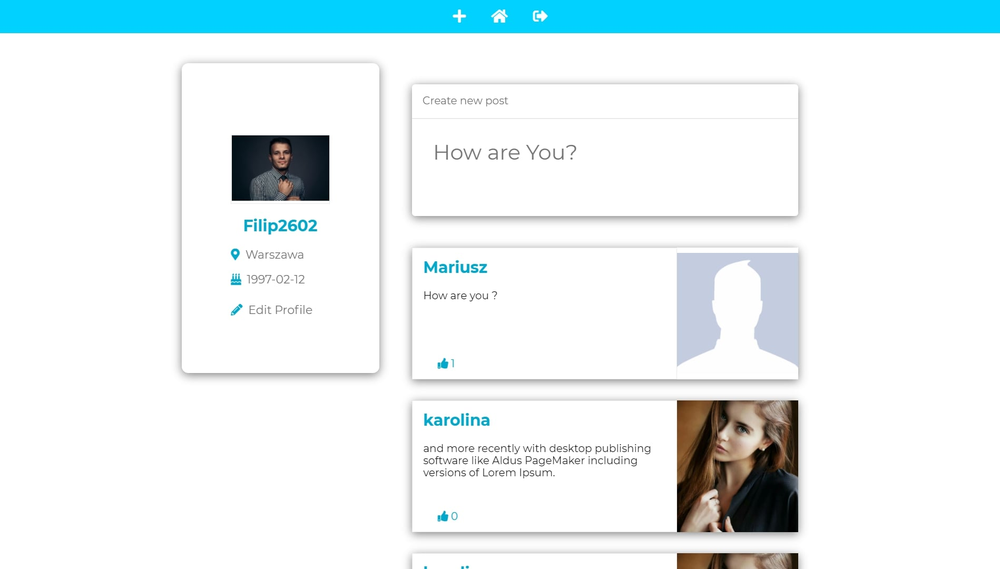
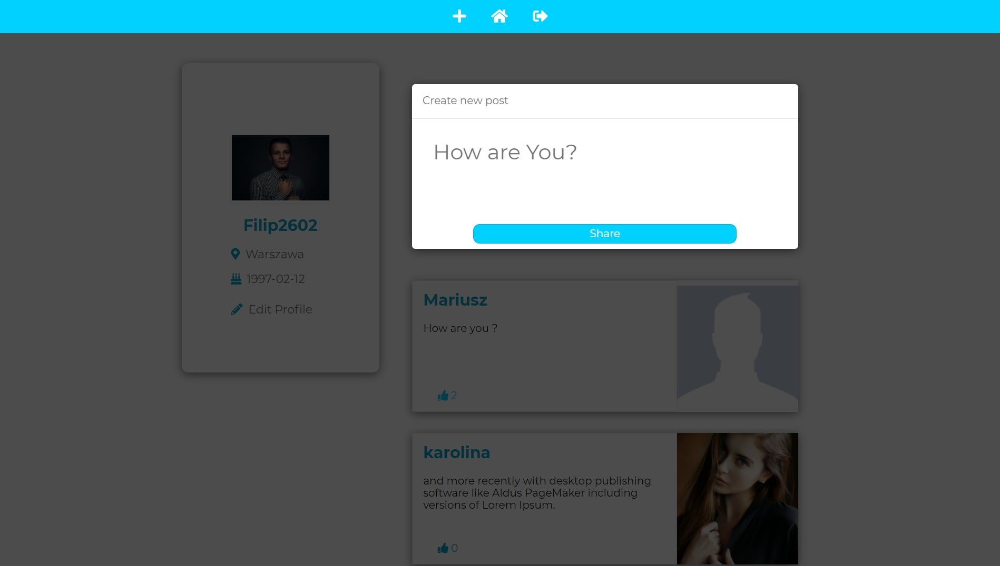
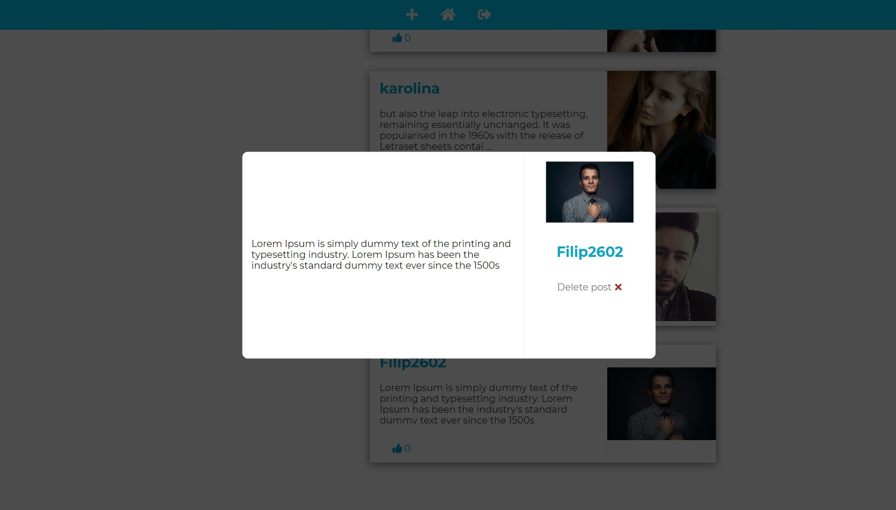

## Social Media App

Social Media App is project made with React, node js and mongodb.

## Demo

https://socialmediaaplication.herokuapp.com/

## Technologies

- React 16.13.1
- Redux 4.0.5
- Node js
- Mongoose 5.9.25
- Styled-components 5.1.1
- Express 4.17.1
- Bcrypt 5.0.0
- Formik & Yup

## Features

- Login to account
- Register an account
- Change user data
- Add/remove posts
- Like Posts

## Screenshots

